# 車牌偵測與辨識 (by Yolov4/Tesseract)
# Car plate detection and recognition from scratch by Yolov4/Tesseract
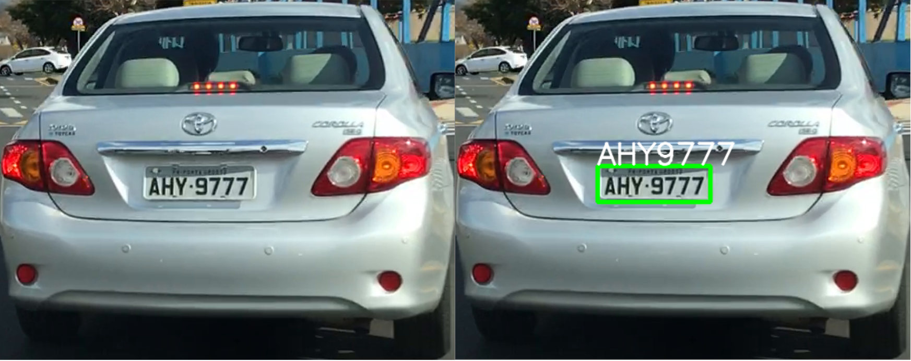

### 目的
##### 有開車的朋友都知道，現在很多大型停車場在出入口處都已經內建自動化車牌辨識系統，讓人有種置身高科技社會的感受，但是其實只要使用Yolo訓練一下車輛車牌圖片，自己也能DIY一個不錯的車牌辨識系統放在自家車庫中喔~  
##### 如果直接把一張車輛照片給OCR做文字辨識，因為必須把整張照片掃過一遍去做辨識，那肯定速度奇慢且效果不佳。所以最佳的方式是先用物件偵測把車牌找出來，然後獨立框出來給OCR做辨識，那才能達到最佳辨識效果。所以這篇簡單介紹一下使用Yolo_v4來訓練車牌偵測的模型，然後再使用OCR相關套件來做辨識，看看不同環境不同車牌樣式不同尺寸等的辨識效果。

### 資料集(dataset)
##### 網路上有提供少許公開的車輛和車牌圖片集，最主要的是要有包含車牌的邊界框(bounding box)以及車牌文字的資訊，這樣可以少掉自己去標記的大量時間。我們的目的在於車牌的偵測與辨識，所以可以直接用Yolo去抓取圖片中車牌的位置然後再將其獨立出來去辨識內容即可。  
##### 網路上可以蒐集到的車輛車牌資料集大概有分兩種，第一種是由行車監視系統跟拍前方車輛取得，第二種則是拍攝停放在路邊的車輛。但是其實這兩種都不太適合我們前頭所說停車場出入口的車牌辨識使用。最主要的原因在於圖片中的車牌會過小，雖然 Yolo 可以偵測的到，但是OCR卻很難辨識車牌的文字，後面的測試會展示一下這慘烈的結果... 如果可以的話當然還是模仿各大停車場的架設，把攝影機就裝在閘門旁下方或上方，直接對準車子拍攝車牌，這樣可以達到最佳辨識效果。  
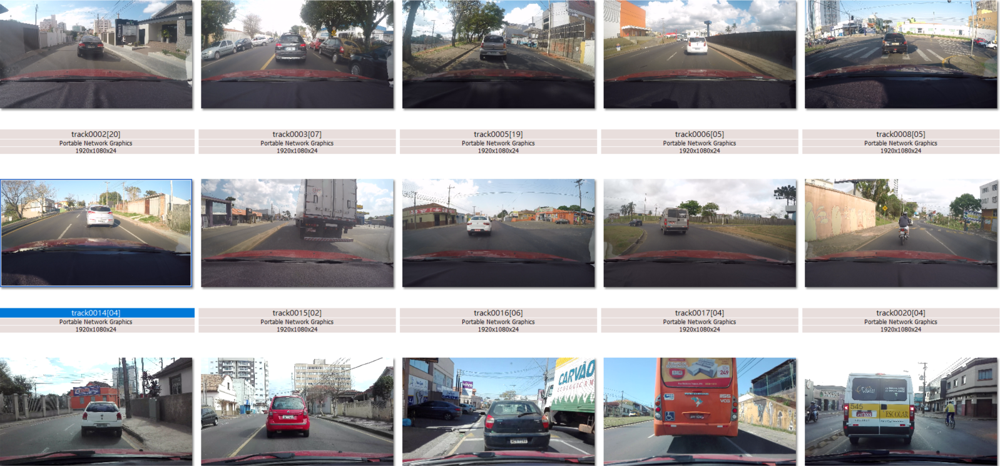
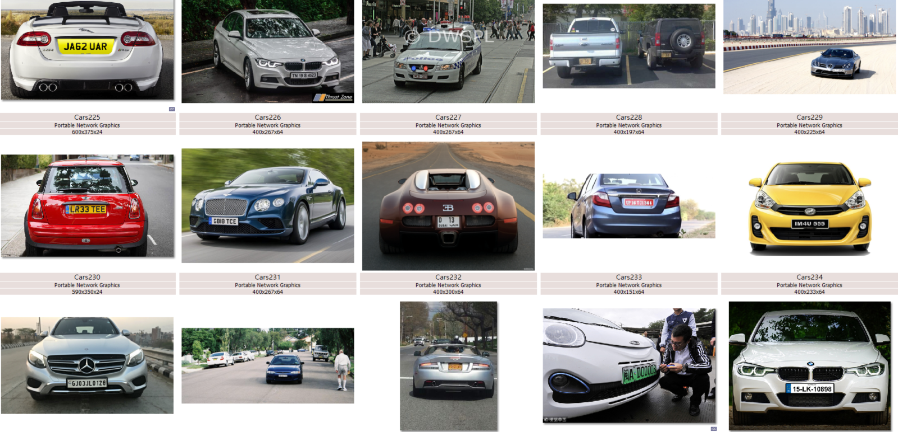  
##### 這邊用到的資料集，除了前面提到的兩種網路上可以蒐集來的已標記的圖檔，為了可以在川流不息的道路上做車牌偵測，這邊另外從網路上找了一些馬路車流的影片並手動使用Labelimg標記的照片。  
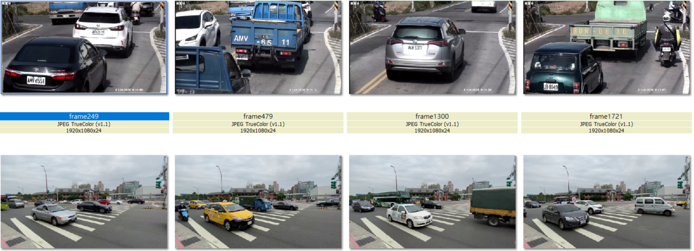  

### 訓練(Training)
##### 這邊使用的是 Yolov4 作為物件偵測的機器學習套件，把準備好的圖片放入資料夾中，並且以 80/20 比例分成 訓練集(train)與驗證集(valid)，就可以開始使用 Yolo 來訓練。首先修改一下 data/car_plate.yaml，指定好圖片放置位置路徑，並將類別數量(nc) 改成 nc:1 以及名稱改成 name: [‘plate’] (只有車牌一種分類)即可開始訓練。
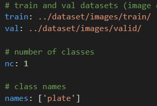
##### 這邊看一下不同模型大小(4S vs. 4L)訓練100 epochs的結果:
* Learning Rate:  
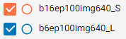
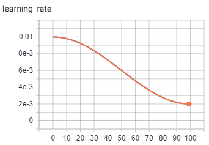

* mAP / Precision / Recall
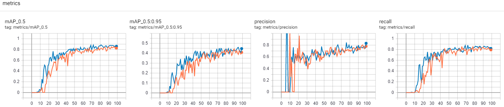

* Train Loss
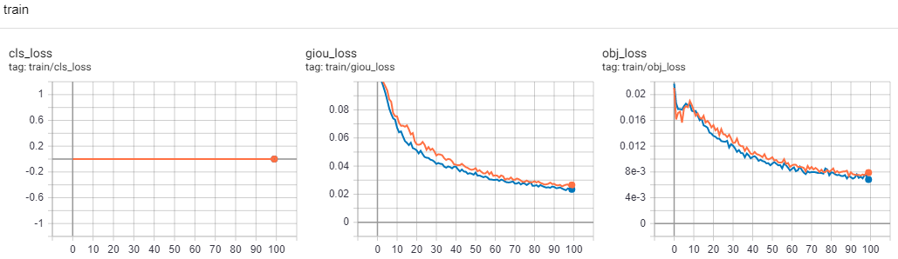

* Valid Loss
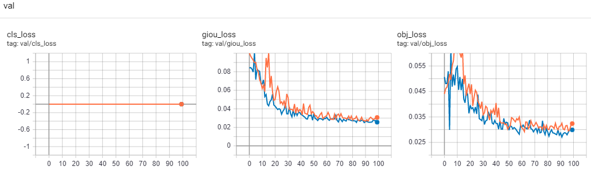

##### 上面的分類損失都是0是因為只有一個種類(車牌)而已。這邊的訓練是採取從零開始(From-Scratch)，主要是自己想看一下這種小邊界框圖片集的訓練效果。整體看起來除了早期的不穩定以外，4L 大模型的結果只有比 4S 好上一點點，應該是測試集圖片過少且變化過少造成，當然車牌是個容易偵測的物件也是原因之一。另外如果用遷移式學習(transfer learning)應該會有更佳的準確效果。

### 車牌偵測
##### 首先先用較簡單容易偵測的圖片看看效果，看起來結果還是挺不錯的。不過車牌偵測的邊界框其實最好是限制在文字旁，尤其千萬不能超出車牌的框外，否則多出一點車牌框線就會讓後面的OCR極容易誤判成數字 1，當然這就得極為仰賴訓練圖片集的標記正確性了。
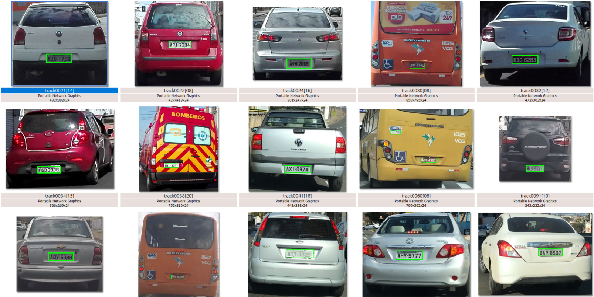
##### 下面則是從網路上找到的川流不息車輛的測試結果(如果有侵權請務必告知，我會刪除並置換)，看起來效果也挺不錯的，除了公車身上有太多文字和數字容易誤判以外(也是因為訓練集太少公車的圖片所導致)，其他白色車牌的偵測效果都還不錯。

### 車牌辨識
##### 車牌辨識的大魔王則是OCR(optical character recognition)光學文字辨識部分，這是個悠久歷史的老題目，雖然常見套件如 easyocr、tefferact 等等都有不錯的效果，但是遇上文字過小、車牌歪斜或是過於模糊的還是常常無法辨識的很好。
##### 下面是用 tesseract 測試幾張容易辨識的圖片:
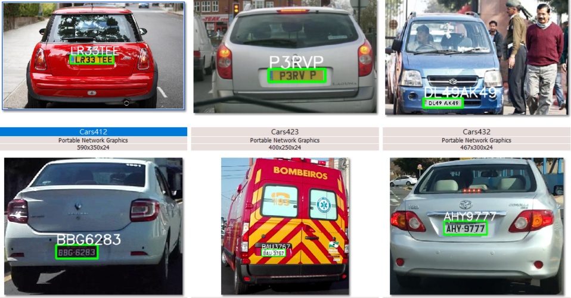
##### 不過還是部份會有判斷錯誤的:
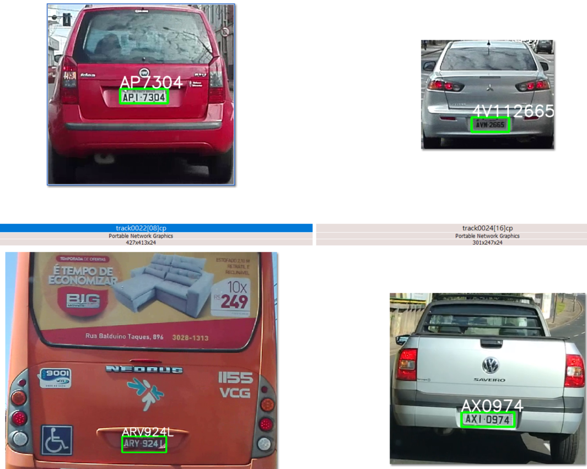
##### 當然最慘的還是小車牌的結果，下面圖片中只有部分車輛有被清楚辨識到，但絕大部分還是都是無法辨識成功…
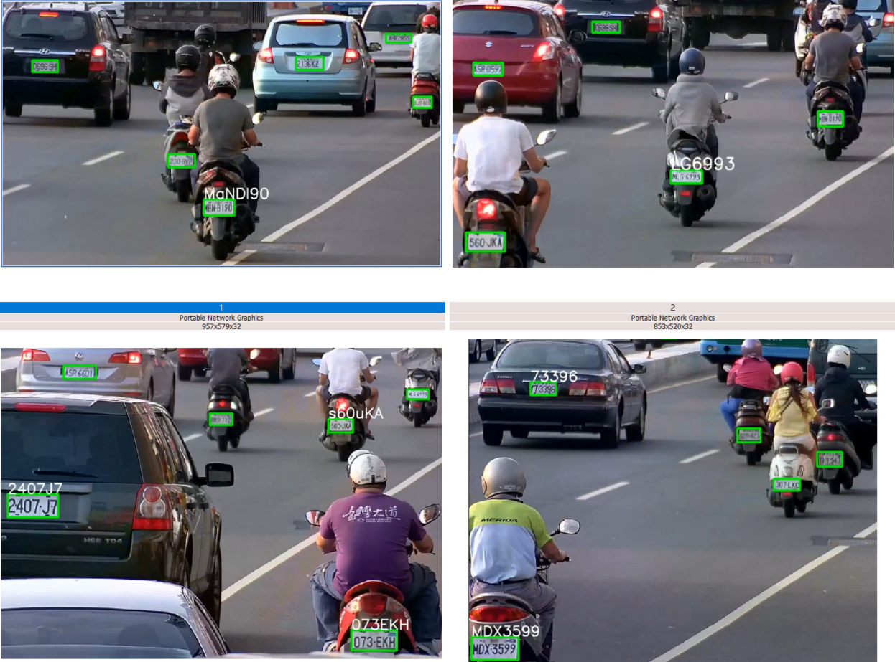  

### 結論
##### 以車牌偵測來說，Yolo可以達到相當不錯的效果，即使訓練圖片集不多，但是因為只有一種分類而已，而且車牌的樣式又屬於容易辨別，所以模型訓練上mAP05還能達到0.8以上。不過文字辨識的OCR就沒這麼簡單了，尤其車牌在圖片中只佔極小範圍，即使先用預測出來的邊界框把車牌框出並獨立出來給OCR辨識也是有其極限。所以如果真要做車牌辨識，勢必得使用更高解析度的照片、更近距離拍攝車牌、或是用更高階的方式把車牌做向上採樣、清晰化、高解析GAN等等方式看看是否能夠增強圖片品質來達到更好的辨識效果。  

###### 影片來源: Youtube (擷取部分片段，如有侵權，請來信告知，會予以刪除)

### 參考資料
* Yolov4: https://github.com/WongKinYiu/PyTorch_YOLOv4
* Yolov5: https://github.com/ultralytics/yolov5
* Labelimg: https://github.com/tzutalin/labelImg
* Tesseract: https://pypi.org/project/pytesseract/
